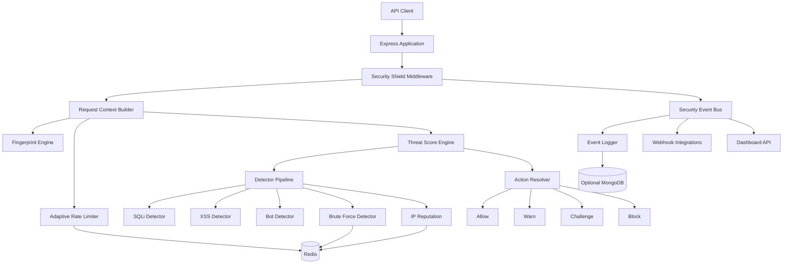
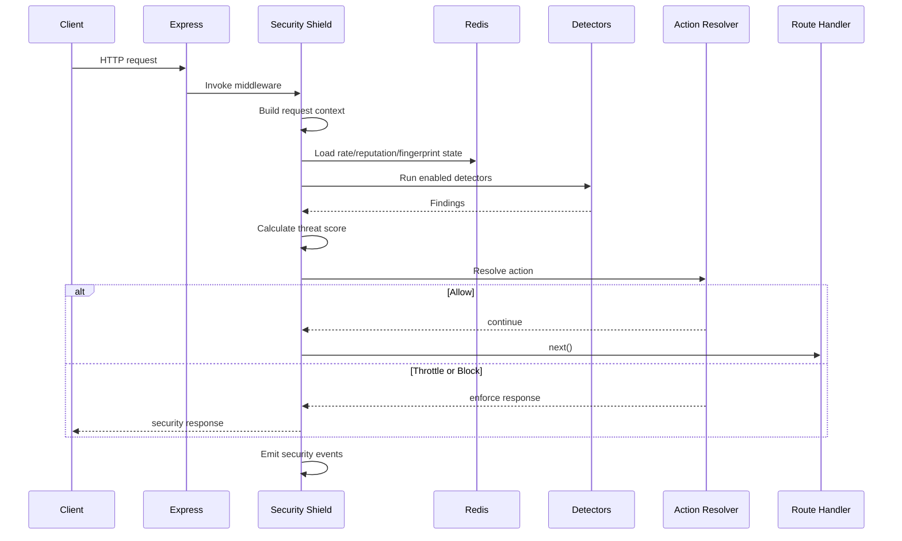
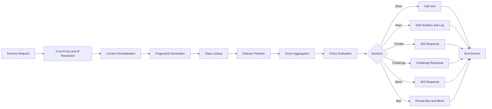
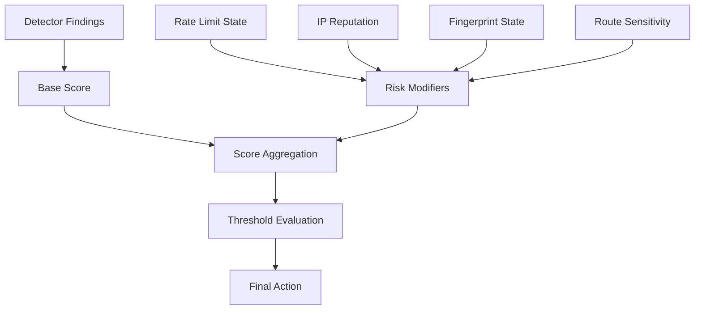
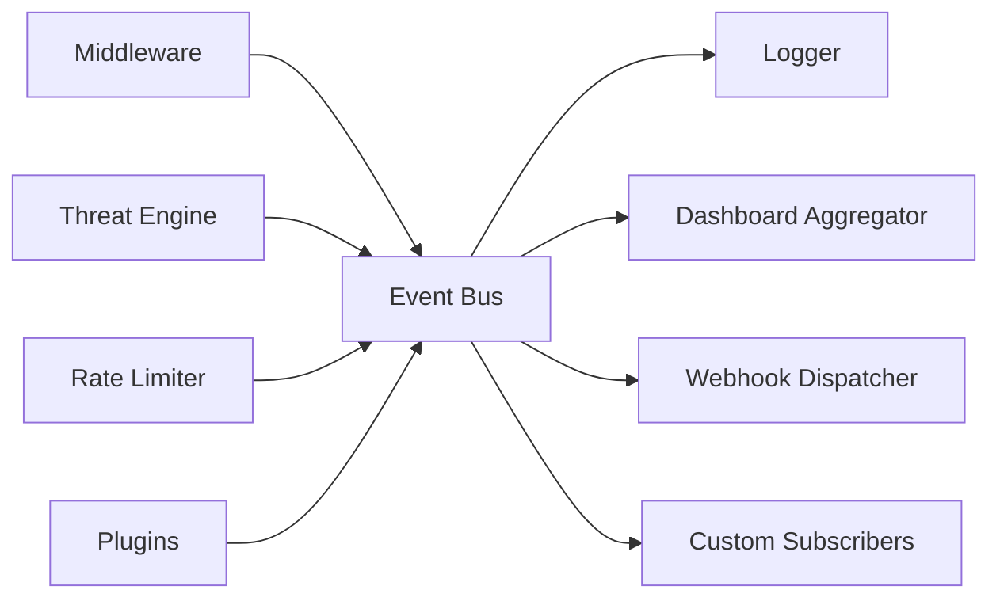
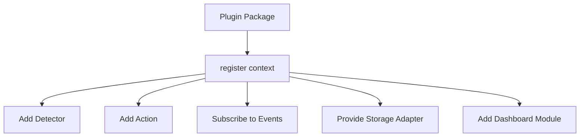
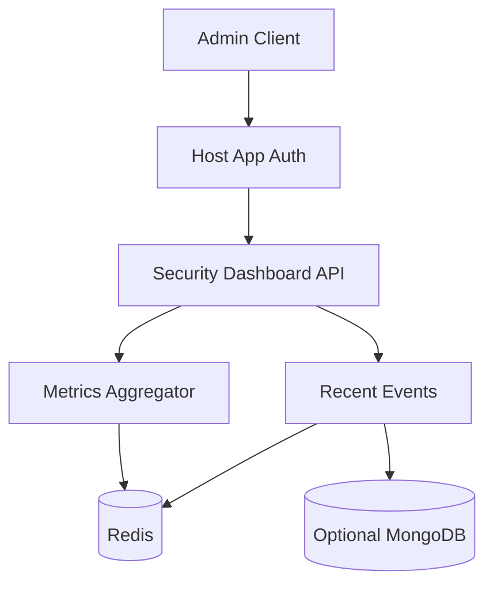

# API Security Shield Architecture

## Vision

API Security Shield is an intelligent API protection library for modern Node.js applications. It is designed to act as a lightweight API firewall, bot protection layer, threat detection engine, and abuse prevention system for Express.js services.

The project should feel simple to adopt and serious enough for production. A developer should be able to enable protection with a single middleware call, then progressively add Redis, custom detectors, dashboard routes, webhooks, and organization-specific policies as their application grows.

```ts
import { securityShield } from "api-security-shield";

app.use(
  securityShield({
    threatEngine: true,
    fingerprinting: true,
    botDetection: true,
    adaptiveRateLimit: true
  })
);
```

## Architecture Goals

- Modular packages with clear ownership boundaries.
- High performance request analysis with predictable latency.
- Event-driven internals for observability and extensibility.
- Type-safe public APIs and plugin contracts.
- Redis-backed distributed protection for production deployments.
- Zero-configuration default setup for quick adoption.
- Adapter-oriented future support for Fastify and NestJS.
- Optional MongoDB persistence for long-term audit and analytics.

## High-Level Components



## Core Concepts

### Request Context

The request context is the normalized internal object created for each incoming request. It contains request metadata, headers, IP data, body/query samples, route metadata, fingerprint data, detector findings, threat score, and the final enforcement decision.

### Detector

A detector inspects a request context and returns one or more findings. Detectors should be small, deterministic, and individually testable. Examples include SQL injection pattern detection, XSS payload detection, suspicious user-agent analysis, credential stuffing detection, and honeypot trap matches.

### Finding

A finding is a structured security signal produced by a detector. It includes severity, confidence, category, matched location, optional evidence, and scoring contribution.

### Threat Score

The threat score is a normalized risk value from `0` to `100`. It is calculated from detector findings, rate-limit state, IP reputation, fingerprint consistency, and route sensitivity.

### Action

An action is the enforcement outcome selected from the final threat score and policy configuration. Default actions are allow, warn, challenge, throttle, block, and ban.

### Event

An event is a structured message emitted by the system. Events are used for logging, dashboard analytics, webhooks, and plugin integrations.

### Plugin

A plugin extends the platform with custom detectors, actions, enrichers, event subscribers, integrations, or storage adapters.

## Security Model

API Security Shield uses layered decision-making:

1. Normalize the request into a safe internal context.
2. Apply fast pre-checks such as bypass rules, known bans, and trusted proxy parsing.
3. Run fingerprinting and state lookups.
4. Execute enabled detectors.
5. Calculate a threat score.
6. Resolve an action based on score thresholds and route policy.
7. Emit security events.
8. Continue, warn, throttle, challenge, block, or ban.

Default threat levels:

| Score | Level | Default action | Meaning |
| --- | --- | --- | --- |
| 0-24 | Low | Allow | Normal or low-risk traffic |
| 25-49 | Watch | Allow and log | Suspicious but not enough to disrupt |
| 50-69 | Warning | Warn and increase scrutiny | Multiple weak signals or one strong signal |
| 70-89 | High | Block or throttle | Likely attack or abuse |
| 90-100 | Critical | Block and escalate | Confirmed malicious behavior |

## Middleware Flow



## Request Lifecycle



## Threat Engine Design

The threat engine owns scoring, detector orchestration, and action resolution.

Responsibilities:

- Execute detectors in deterministic priority order.
- Support short-circuit behavior for known bans and honeypot hits.
- Merge detector findings into a normalized threat score.
- Apply route sensitivity multipliers.
- Support custom scoring rules.
- Emit score, finding, and action events.

Scoring inputs:

- Detector severity and confidence.
- Request route and HTTP method.
- Rate-limit pressure.
- IP reputation.
- Fingerprint stability.
- Authentication context when provided by the host app.
- Historical behavior from Redis.



## Fingerprinting Design

Fingerprinting creates a stable but privacy-conscious identifier for request correlation and abuse detection.

Signals:

- IP address or trusted proxy client IP.
- User-Agent family and version.
- Accept, Accept-Language, Accept-Encoding, and connection headers.
- TLS/proxy-derived hints when available from the hosting environment.
- Session ID, authenticated user ID, or API key hash when provided.
- Optional browser hints for browser-facing APIs.

Principles:

- Do not store raw secrets, tokens, cookies, or full authorization headers.
- Hash sensitive values before persistence.
- Allow applications to provide custom fingerprint components.
- Support both strict and loose fingerprints for different detection modes.

## Adaptive Rate Limiting Design

Adaptive rate limiting combines static route limits with dynamic risk-based limits.

Inputs:

- Route policy.
- HTTP method.
- Fingerprint ID.
- IP address.
- Authenticated account or API key.
- Threat score.
- Recent attack events.

The limiter should support fixed window, sliding window, and token bucket strategies. Redis is required for distributed production deployments. In-memory storage is acceptable only for development and tests.

## Bot Detection Design

Bot detection uses layered signals:

- User-Agent allowlist and denylist checks.
- Missing or inconsistent browser headers.
- Suspicious request cadence.
- Repeated path discovery patterns.
- High error-rate behavior.
- Fingerprint churn.
- Known automation tooling signatures.

Bot detection should distinguish between malicious automation, unknown automation, and verified good bots. Verified good bots require cautious validation, preferably DNS or provider verification in a future phase.

## Event System Design

The event system is the backbone for observability and integration.



Event categories:

- `request.analyzed`
- `threat.detected`
- `threat.scored`
- `action.enforced`
- `rate_limit.exceeded`
- `brute_force.detected`
- `fingerprint.changed`
- `honeypot.triggered`
- `plugin.error`
- `storage.error`

Events should be structured, typed, and safe to serialize. Sensitive fields must be redacted before emission.

## Plugin System Design

Plugins are registered during middleware initialization and receive a typed registration context.

Plugin extension points:

- Detectors.
- Scorers.
- Actions.
- Request enrichers.
- Event subscribers.
- Storage adapters.
- Dashboard panels.
- Webhook providers.



Plugin requirements:

- Plugins must declare a name and version.
- Plugin hooks must be isolated from core failures.
- Plugin errors must emit events.
- Plugins must not mutate request context outside documented APIs.

## Redis Architecture

Redis stores short-lived and distributed security state.

Primary data:

- Rate-limit counters.
- Brute force attempt counters.
- IP and fingerprint reputation.
- Temporary bans.
- Honeypot escalations.
- Recent event aggregates for dashboard APIs.
- Fingerprint history.

Key pattern examples:

| Purpose | Key pattern | TTL |
| --- | --- | --- |
| Route rate limit | `ass:rl:{route}:{identity}` | Window duration |
| Brute force account | `ass:bf:acct:{accountHash}` | 15 minutes to 24 hours |
| IP reputation | `ass:rep:ip:{ipHash}` | Rolling, configurable |
| Temporary ban | `ass:ban:{identity}` | Ban duration |
| Fingerprint history | `ass:fp:{fingerprintHash}` | 7 to 30 days |
| Dashboard aggregate | `ass:dash:{metric}:{bucket}` | 24 hours to 30 days |

Redis operations should prefer atomic commands, Lua scripts, or transactions where correctness depends on multi-key updates.

## Dashboard Architecture

The dashboard API is an optional Express router mounted by the host application. It exposes security analytics and operational state, but authentication and authorization remain the host application's responsibility.



Dashboard capabilities:

- Threat counts by category.
- Blocked request statistics.
- Top attacking IPs or fingerprints.
- Rate-limit pressure by route.
- Recent high-severity events.
- Ban and reputation inspection.
- Health status for Redis, logger, and plugins.

## API Design

Primary public entrypoints:

- `securityShield(options?)`: Express middleware factory.
- `createDashboardRouter(options?)`: optional dashboard API router.
- `createRedisStorage(options)`: Redis storage adapter.
- `definePlugin(plugin)`: plugin helper.
- `createDetector(detector)`: custom detector helper.

The public API should keep common usage simple while allowing deep customization through typed module options.

## Performance Considerations

- Keep detector execution bounded and configurable.
- Limit body scanning size by default.
- Avoid blocking network calls in the hot request path.
- Use Redis pipelining for state lookups.
- Cache compiled detection patterns.
- Support detector priority and early exits for critical decisions.
- Emit events asynchronously where possible.
- Redact and sample logs during high-volume attacks.

## Security Considerations

- Default to safe parsing and bounded scanning.
- Never log secrets, raw tokens, passwords, or full cookies.
- Treat `X-Forwarded-For` as untrusted unless trusted proxy configuration is enabled.
- Dashboard routes must require host-provided authentication.
- Webhooks must support signing or shared-secret validation where possible.
- Avoid regex patterns vulnerable to catastrophic backtracking.
- Store hashes for sensitive identity components.
- Provide clear controls for false positive tuning.

